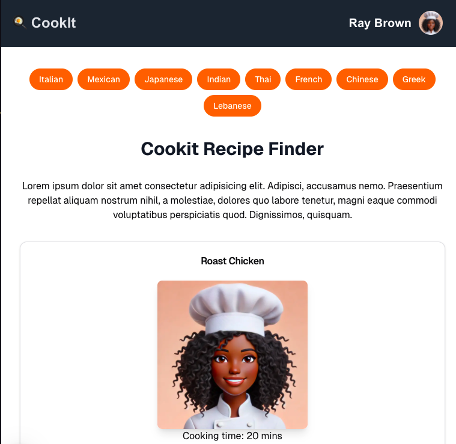

# 🍳 CookIt

CookIt is a Next.js recipe app that allows users to search for recipes using a recipe API and filter them based on cuisine types. Built with React.js, JavaScript, TypeScript, Tailwind CSS, Shadcn/ui and REST API. 

---


## 🛠️ Tech Stack


---


## ✨ Features

- **Search Recipes:** Find recipes based on ingredients, cuisine, or keywords through an integrated API.
- **Cuisine Filters:** Narrow down search results by filtering recipes according to cuisine types.
- **Recipe Details:** View detailed information about each recipe, including ingredients, preparation steps, and cook time.
- **Save Favourites:** Bookmark recipes for easy access later.
- **Responsive Design:** Fully responsive UI to provide a seamless experience across devices.
- **Theme Customisation:** Choose between light and dark themes using Tailwind's theme switcher.
- **Optimised Performance:** Leveraging Next.js for server-side rendering (SSR) and static site generation (SSG).
- **Reusable Components:** Built with `shadcn/ui` to ensure a consistent and modular design system.

---

<!-- ## Deploy on Vercel

The easiest way to deploy your Next.js app is to use the [Vercel Platform](https://vercel.com/new?utm_medium=default-template&filter=next.js&utm_source=create-next-app&utm_campaign=create-next-app-readme) from the creators of Next.js.

Check out our [Next.js deployment documentation](https://nextjs.org/docs/app/building-your-application/deploying) for more details.


This is a [Next.js](https://nextjs.org) project bootstrapped with [`create-next-app`](https://nextjs.org/docs/app/api-reference/cli/create-next-app).

## Getting Started

First, run the development server:

```bash
npm run dev
# or
yarn dev
# or
pnpm dev
# or
bun dev
```

Open [http://localhost:3000](http://localhost:3000) with your browser to see the result.

You can start editing the page by modifying `app/page.tsx`. The page auto-updates as you edit the file.

This project uses [`next/font`](https://nextjs.org/docs/app/building-your-application/optimizing/fonts) to automatically optimize and load [Geist](https://vercel.com/font), a new font family for Vercel.

## Learn More

To learn more about Next.js, take a look at the following resources:

- [Next.js Documentation](https://nextjs.org/docs) - learn about Next.js features and API.
- [Learn Next.js](https://nextjs.org/learn) - an interactive Next.js tutorial.

You can check out [the Next.js GitHub repository](https://github.com/vercel/next.js) - your feedback and contributions are welcome!
 -->
